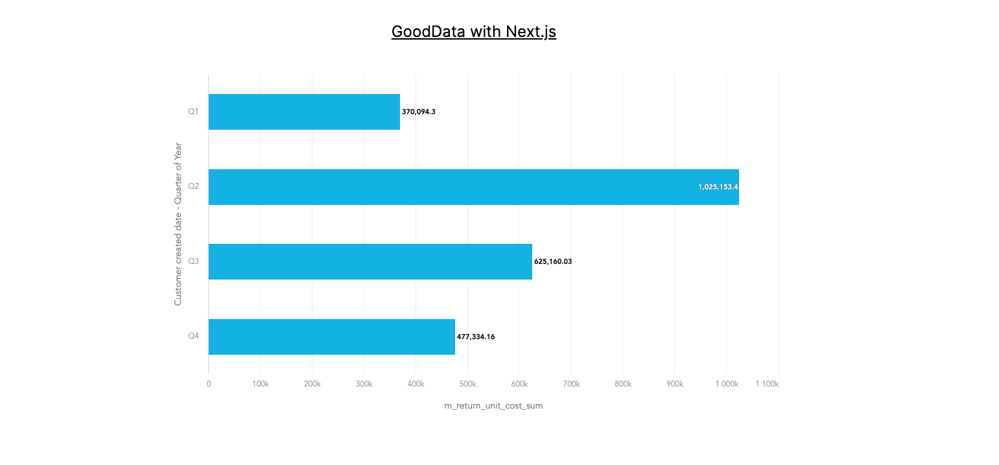

# GoodData with Next.js

The repository contains demo of GoodData with Next.js. The [result](#result) is visualization from GoodData rendered in Next.js environment.

If you have any questions, feel free to ask me on [GoodData slack](https://www.gooddata.com/slack/) (@Patrik Braborec). Also, for more information you can check [GoodData UI SDK](https://www.gooddata.com/docs/gooddata-ui/latest/).

## How to Render GoodData visualization in Next.js

### Step 1: Install all necessary dependencies

The following packages deal with GoodData backend:

```bash
npm i @gooddata/api-client-tiger @gooddata/sdk-backend-tiger
```

The following package contains *all* components of GoodData UI SDK:

```bash
npm i @gooddata/sdk-ui-all
```

*Tip: If you do not need to install all components, you can select only those you need. More info is in the [documentation](https://www.gooddata.com/docs/gooddata-ui/latest/learn/integrate_and_authenticate/cn_and_cloud_integration/#IntegrateCNandCloudintoanExistingApplication-Step1Installthenecessarydependencies).*

The following package will help you generate a file with code representation of all available metrics and attributes in your GoodData Cloud:

```bash
npm i -D @gooddata/catalog-export
```

### Step 2: Extend package.json

You need to modify `package.json`, and add the following properties:

```bash
"gooddata": {
    "hostname": "<your-gooddata-host>",
    "workspaceId": "<your-workspace-id>",
    "catalogOutput": "app/gooddata-export.ts",
    "backend": "tiger"
}
```

The configuration is for the `catalog-export` tool that exports all available metrics and attributes to a single file that you can reference in your code.

### Step 3: Add a new script to package.json

```bash
"scripts": {
    "dev": "next dev",
    "build": "next build",
    "start": "next start",
    "lint": "next lint",
    "refresh-md": "gdc-catalog-export" <-- this is the new script you need to add!
},
```

### Step 4: Add API token

```bash
export TIGER_API_TOKEN=<your-api-token>
```

*Note: more info on how to get API token is in the [documentation](https://www.gooddata.com/developers/cloud-native/doc/cloud/getting-started/create-api-token/).*

### Step 5: Configure CORS in GoodData

If your Next.js application runs on different domain that GoodData (which is the most probable scenario), you need to configure CORS. Basically, you need to go to *<your-gooddata-host>/settings* and add Cross-origin resource sharing (CORS). If your Next.js application runs on domain *https://super-cool-app.com*, you need to add *https://super-cool-app.com* to CORS. You can find more information in the [documentation](https://www.gooddata.com/developers/cloud-native/doc/cloud/manage-organization/set-up-cors-for-organization/).

### Step 6: Run catalog-export tool to export metrics and attributes

```bash
npm run refresh-md
```

The succesful result is: *The result generated from workspace with id <your-workspace-id> is located at <your-project-folder>/app/gooddata-export.ts*.
    
### Step 7: Add styles

Add GoodData styles to `layout.tsx`:

```javascript
import "@gooddata/sdk-ui-filters/styles/css/main.css";
import "@gooddata/sdk-ui-charts/styles/css/main.css";
import "@gooddata/sdk-ui-geo/styles/css/main.css";
import "@gooddata/sdk-ui-pivot/styles/css/main.css";
import "@gooddata/sdk-ui-kit/styles/css/main.css";
import "@gooddata/sdk-ui-ext/styles/css/main.css";
```

### Step 8: Build your visualization

The following code snippet contains example of simple GoodData visualization. You can find the whole component in [app/page.tsx](./app/page.tsx).

```javascript
const measures = [ReturnUnitCost.Sum];
const attributes = [DateDatasets.CustomerCreatedDate.CustomerCreatedDateQuarterOfYear.Default];

return (
<BackendProvider backend={backend}>
    <WorkspaceProvider workspace="<your-workspace-id>">
        <div className="w-full h-full flex flex-col items-center">
            <h1 className="my-10 text-2xl underline">GoodData with Next.js</h1>

            <div className="w-1/2 h-1/2">
                <BarChart
                measures={measures}
                viewBy={attributes}
                />
            </div>
        </div>
    </WorkspaceProvider>
</BackendProvider>
```

Now you can run your Next.js application with GoodData visualization.

## Run the Application

If you want to run this demo, please make sure you configured everything correctly (regarding to GoodData) as is desribed in the chapter above.

Install all dependencies (you can skip that, if you already installed your dependencies):

```bash
npm install
```

Run development server:

```bash
npm run dev
```

## Result

The following screenshot shows how this demo looks like:


